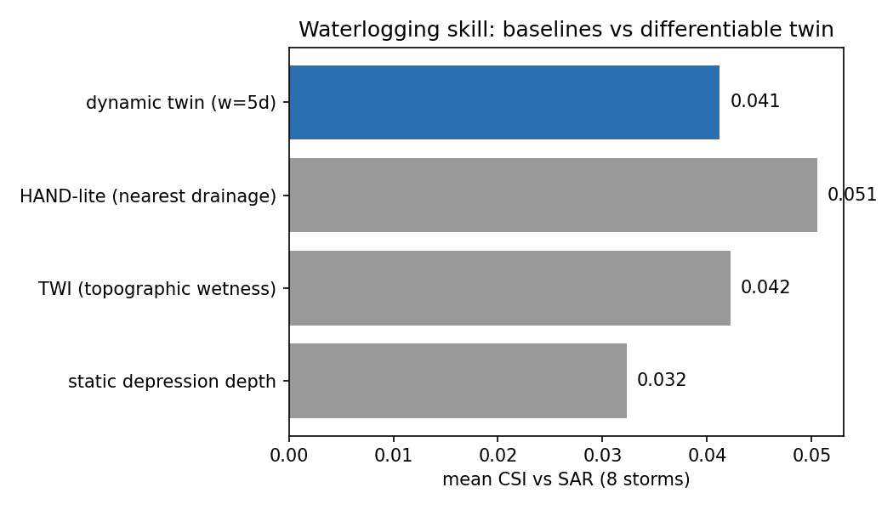
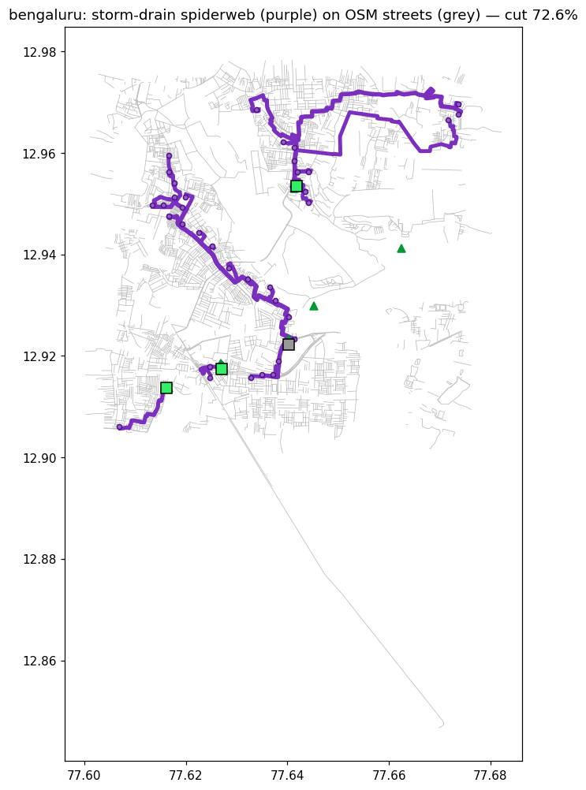
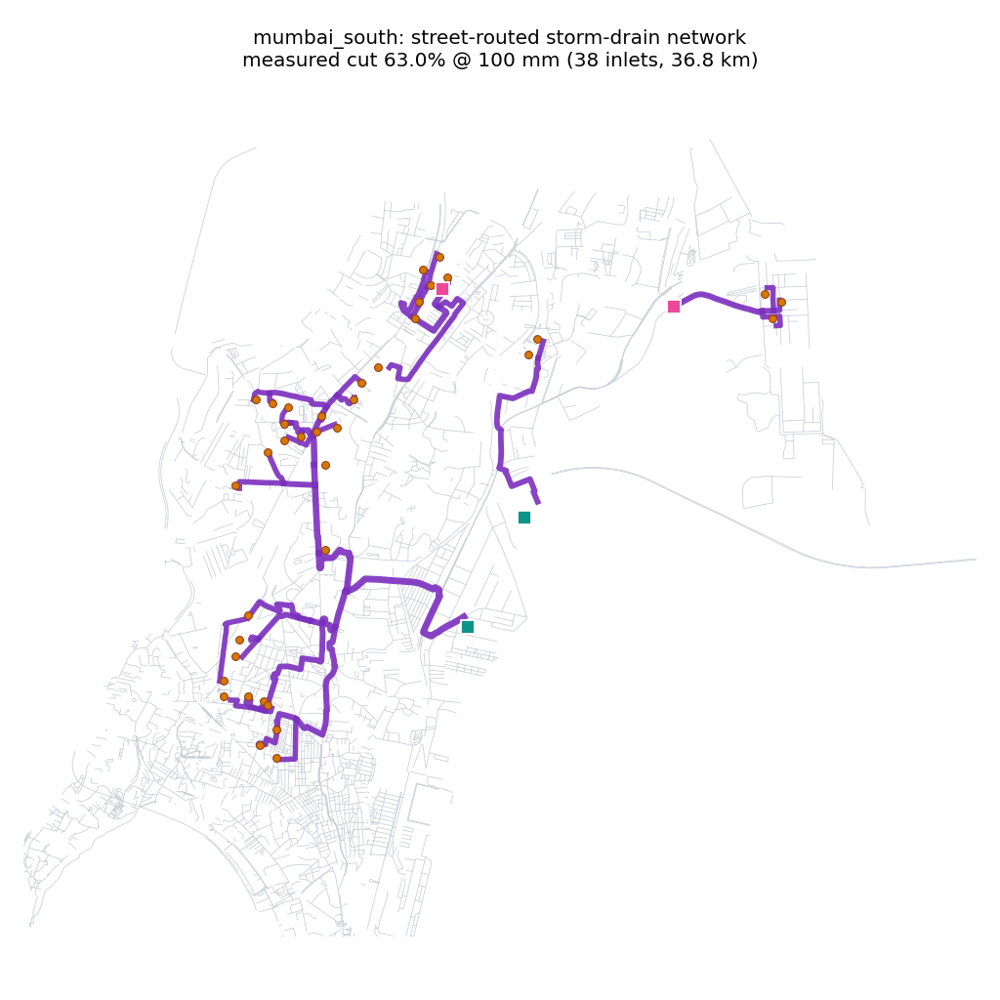
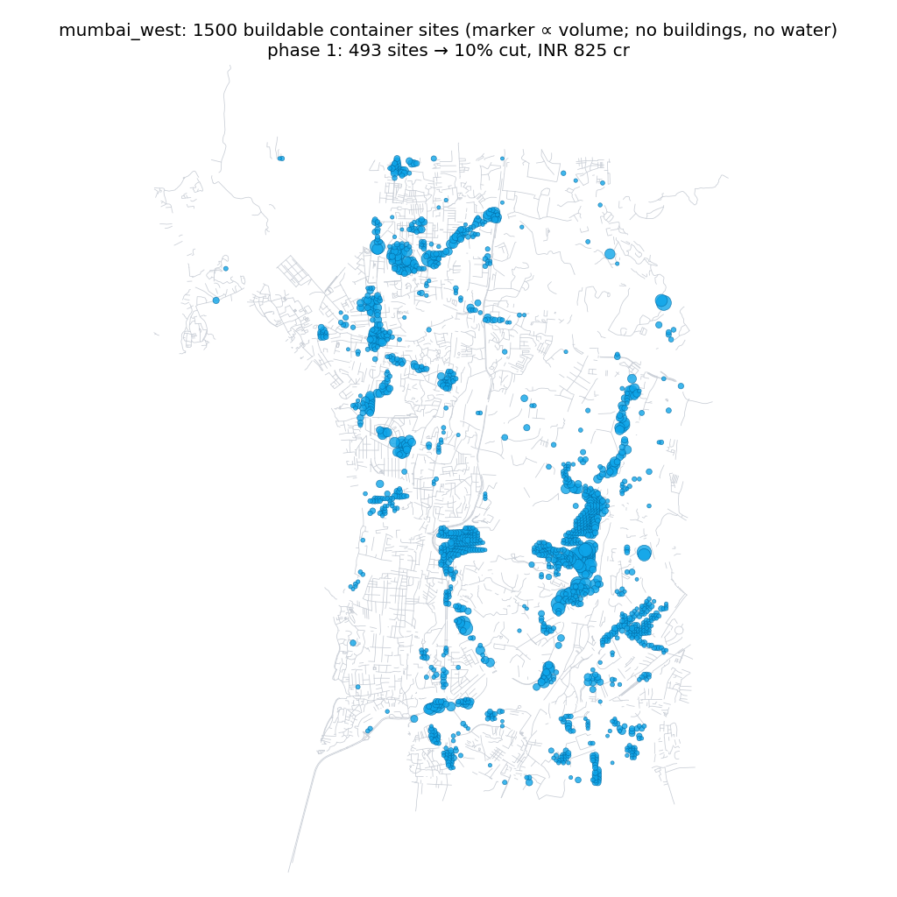
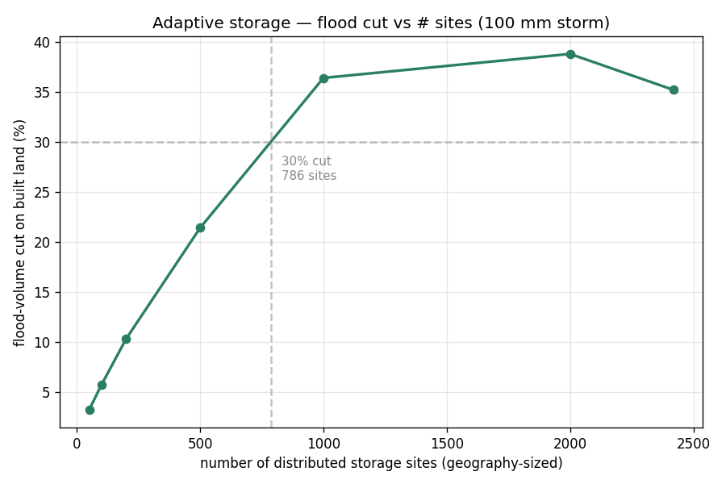
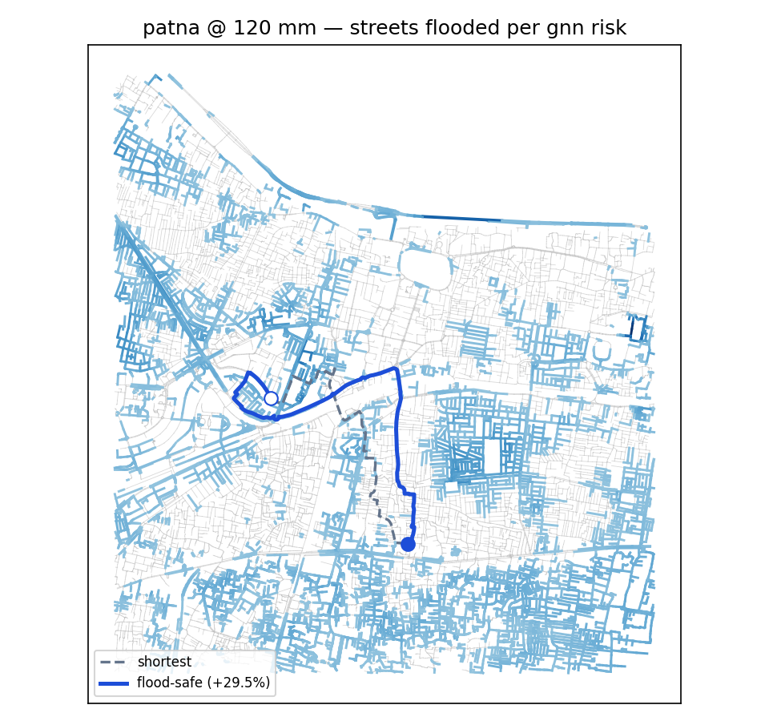

# Varuna FloodTwin: an honestly-validated, free-tier flood digital twin with street-routed drainage planning for Indian cities

*Ansh Vivek — independent researcher — anshvivek2003@gmail.com*

> Markdown mirror of `varuna-floodtwin.tex` (the submission copy is canonical). Numbers trace to the
> artifact bundles — see the provenance table in `paper/README.md`.
> Live dashboard: https://project-varuna-iota.vercel.app · API: https://anshvivek-varuna-floodtwin.hf.space

## Abstract

Urban waterlogging routinely paralyses Indian cities, yet municipal drainage planning rarely has access to calibrated hydraulic models. We present **Varuna FloodTwin**, an end-to-end open pipeline that builds a differentiable urban flood twin for any area of interest from free satellite data (FABDEM, ESA WorldCover, JRC surface water, Sentinel-1), trains a millisecond what-if emulator, and serves both through a public web dashboard — with every stage running on free tiers (Colab/Kaggle GPUs to build, CPU to serve). The system covers three cities — Patna, Bengaluru, and Mumbai (BMC, as four exactly-tessellating 256² tiles with a city-wide view) — and adds a live participatory layer: citizen flood reports that feed a reward-gated nightly fine-tuning loop, live-forecast alerts, exact storm water-balance accounting, grounded multilingual advisories, and a satellite power-outage overlay. We report five findings.

1. **An honest negative result.** Against 8 Sentinel-1 flood masks over Patna, the dynamic twin scores mean CSI 0.033–0.041 — statistically indistinguishable from static topographic baselines (depression depth 0.032, TWI 0.042, HAND-lite 0.051) — and gradient calibration of per-land-class roughness/infiltration is near-null (held-out CSI 0.048 → 0.049): the model predicts a comparable flooded *area* but not its *location*.
2. **The failure is terrain-fundamental, not model-specific.** Under a ±1 m spatially-correlated DEM ensemble, total flooded area is stable (Patna 10.79 ± 0.35 km²) but only 5% of it is co-located across members on deltaic flats, versus 52% in hillier Bengaluru.
3. **Planning can survive location uncertainty.** Intervention value is *measured by re-simulation*, never assumed. A dense storm-drain "spiderweb" routed along the real OpenStreetMap street graph — ~40 inlets, one reverse multi-source Dijkstra from safe low-ground outfalls (never the river, which runs high during floods) — cuts simulated street flooding by **73–89%** in the Patna and Bengaluru windows and **33–63%** across the four denser Mumbai tiles at 100 mm/day, versus 21–26% for sparse least-cost canals, while *improving* cost-efficiency (₹850 vs ₹1,309 per m³ removed in Patna). A complementary distributed-storage planner sites detention containers only where they can physically go (no building footprints, no permanent water, under-street allowed) and emits phased, indicatively-costed build-out plans; its top-ranked sites land on each city's notorious flood spots (Koramangala in Bengaluru; the Mithi at Kalina in Mumbai) with no city-specific tuning.
4. **Street-level flood knowledge is learnable and city-transferable.** A graph neural network over the OSM street graph, trained only on labels the twin generates itself and FiLM-conditioned on rainfall, amortizes the raster pipeline into a millisecond per-street risk ranking at any storm size (edge AUC 0.89–0.94 on held-out storms), yields evacuation routes that recover 65% of an oracle's floodwater avoidance at 57% of its detour, and — its features being local and per-graph standardized — transfers zero-shot between the flat and the hilly city (AUC 0.72–0.85), the learned counterpart of finding 2.
5. **Determinism can lock in failure.** Because our dataset generator reseeds the global RNG with a fixed seed, the emulator received a bit-identical initialization on every rebuild — and on the half-ocean Mumbai Island-City tile that exact initialization *deterministically* collapses to "never flood" (the optimizer drives the softplus head into its zero-gradient regime; the tell is a validation RMSE frozen to the last digit across epochs). Naive retries can never fix a seeded collapse; a detect-and-reseed guard turns the worst tile into the best-fitting emulator in the system (5.0 cm validation RMSE).

## 1. Introduction

Pluvial (rain-driven) waterlogging is among the most frequent climate impacts in South Asian cities, and it is worsening under climate change. Yet the planning reality in most Indian municipalities is a drainage map that predates the city's growth, no calibrated hydraulic model, and no budget for commercial modelling. Tools that could plausibly change decisions must therefore be (i) buildable from *free, global* data for *any* area of interest, (ii) cheap enough to run interactively, and (iii) honest about what they can and cannot claim.

**Contributions:**

1. **A reproducible satellite → twin → dashboard pipeline** on free infrastructure: a differentiable 2-D inertial flood twin (Bates et al. 2010) built per-city from FABDEM, ESA WorldCover and JRC surface water; a U-Net-style emulator for millisecond what-ifs; a public FastAPI + React-Leaflet dashboard with live rainfall sliders, intervention planners, exposure views and a grounded LLM brief. Deployed for three cities (nine bundles): Patna and two sub-windows, Bengaluru, and Mumbai (BMC) as four exactly tessellating 256² tiles with a city-wide aggregate view.
2. **An honest validation** against Sentinel-1 SAR that places the twin *and* classical terrain indices (TWI, HAND) in the same low-CSI band on deltaic terrain, plus a DEM-perturbation ensemble that explains *why* — a diagnosis we believe transfers to other flat megacity floodplains.
3. **Street-graph drainage planning**: storm drains routed on the real OSM road network with gravity-aware costs and flood-safe outfall selection (low-lying non-built ground rather than the river), whose benefit is measured by re-simulating the carved terrain. Density is the decisive lever: a ~40-inlet spiderweb removes 4× more flood volume than 2–5 sparse canals at *lower* cost per m³.
4. **Self-supervised street-graph learning (FloodGNN)**: an edge-conditioned message-passing network on the same street graph, FiLM-conditioned on rainfall, trained purely on labels the twin generates (emulator depth sweeps, drain-planner flows). One forward pass ranks every street's flood risk at any rainfall and powers a public flood-safe routing endpoint; a hold-one-city-out experiment extends finding 2 to learned models.
5. **Buildability-constrained, phased intervention portfolios**: detention containers sited only on physically available ground (building footprints and permanent water excluded via rasterized OSM and WorldCover; under-street detention allowed, as Indian cities actually build it), each site sized to its own local pooled depth, with the flood cut *re-measured* after placement and delivered as a 10/20/40%-cut phase ladder with indicative civil-works costs.
6. **A live participatory layer with an auditable learning gate**: rate-limited citizen flood reports persisted to an open dataset; a nightly loop that converts reports plus observed rainfall into supervision and fine-tunes the emulator behind a *reward gate* (band-tolerant depth loss, simulation-replay anchor, bootstrap win-rate) so a model update ships only if it is measurably better and provably not worse; live-forecast alerts, exact storm water-balance accounting (closure to ~10⁻⁶ relative), grounded English/Hindi/Marathi advisories, and a quality-masked VIIRS Black Marble power-outage overlay.

## 2. System

**Build layer (GPU, run once per city).** For an area of interest, Google Earth Engine exports FABDEM (30 m, forests/buildings removed; Copernicus GLO-30 fallback), ESA WorldCover 10 m classes, JRC permanent-water occurrence, and Sentinel-1 GRD scenes. The twin domain is an N×N grid at 60 m — 128² (a 7.7 km window) for the Patna-family and Bengaluru bundles, 256² (15.4 km) for each Mumbai tile; the four tiles share exact lat/lon edges, so city-wide sums never double-count (tiles are independent closed-boundary models: cross-seam flow and tides are not simulated, and the dashboard says so). Terrain analysis yields candidate detention sites; WorldCover classes map to Manning roughness and infiltration tables. The simulator is the inertial shallow-water scheme of Bates et al. (2010) in PyTorch, so every simulation is differentiable end-to-end; rainfall forcing uses Open-Meteo. A flood-weighted U-Net emulator distils the twin for millisecond dashboard queries (wet cells weighted ×20 in the loss — plain MSE collapses to "never flood" because flooding is sparse; validation RMSE 5–21 cm across the nine bundles, monotone dose-response). The same instrumented solver yields an *exact* storm water balance — with closed boundaries, rain = infiltration + ponding to ~10⁻⁶ relative error — which powers a public "where does the rain go?" panel including an all-impervious counterfactual (the ponding avoided by existing soil and vegetation).

**A reproducibility hazard, and its guard.** Our dataset generator seeds the global RNG for reproducible storm sampling — which silently makes the *network initialization* bit-identical on every rebuild. On the Mumbai Island-City tile (19% of cells flood-prone; much of the window is harbour), that particular initialization deterministically collapses: within one epoch the optimizer pushes the softplus output head so far negative that its gradient vanishes, and the emulator is permanently stuck predicting 0 m everywhere while the whole-grid validation RMSE looks plausible (16.3 cm — exactly the RMS of the targets) and stays *frozen to the last digit* across 40 epochs: the signature of exactly-zero gradients. Because the failure is seeded, rebuilding "for luck" can never fix it — we measured three bit-identical collapses before diagnosing it. The shipped trainer now detects a collapsed validation prediction and retrains from explicit alternate seeds; the first alternate seed took this tile from dead to the best-fitting emulator of the nine (5.0 cm validation RMSE). We flag the pattern — **fixed seeds make failures reproducible too** — because build pipelines that reseed globally for data reproducibility are common, and a frozen validation metric is an easy, general tell.

**Serve layer (CPU, free hosting).** A FastAPI backend (Hugging Face Space, Docker) serves the committed per-city artifact bundles — including cached OSM road graphs and exposure, so the deployed service needs no external API access — and re-runs interventions live in seconds. The React-Leaflet frontend (Vercel) exposes rainfall what-ifs, ward alerts, drainage/storage/excavation planners, building- and road-level exposure, validation panels, and an LLM planning brief grounded in the bundle's numbers. Version 2 adds the live layer of §6: citizen reports, live-forecast mode, the water-balance panel with a storage-container designer, multilingual advisories, night lights, and the nightly learning log. Everything runs within free tiers; the total build for a new city window is ~15–25 minutes on a free T4, including all serve artifacts.

## 3. Honest validation: topographic routing does not co-locate flat-city flooding

**Protocol.** Sentinel-1 water masks for 8 Patna monsoon storms (2023–2025) are compared to the dynamic twin forced with the observed antecedent rain, on the same 60 m grid, with permanent water (JRC > 50%) masked *on both sides*, and a single global detection threshold per method chosen to maximise mean CSI (no per-date tuning).

| method | best global threshold | mean CSI |
|---|---|---|
| static depression depth | 0.6 m | 0.032 |
| TWI (topographic wetness) | 13.45 | 0.042 |
| HAND-lite (height above drainage) | 8.57 m | 0.051 |
| dynamic twin (5-day antecedent) | 0.02 m | 0.041 |

**Result.** The twin (mean CSI 0.033 with a 2-day window, 0.041 with 5-day; best single storm 0.112) is indistinguishable from static indices. The twin floods ~2,900 cells and SAR observes ~2,600 — comparable *area*, only ~12% *overlap*. Gradient calibration of 16 per-WorldCover-class Manning/infiltration multipliers (soft-Dice loss vs SAR, 4 training storms, 2 held out) moves held-out CSI only 0.0483 → 0.0488, with multipliers staying in [0.94, 1.14]: roughness and infiltration change *how deep*, not *where*, so their co-location gradient is ≈ 0. We also ruled out a georeferencing artifact: mirroring the SAR mask doubles CSI, but the DEM is provably correctly oriented (corr(−DEM, JRC) = 0.80 unflipped vs 0.05 flipped; the Ganga sits 7.8 m below domain mean), so the flip is a coincidental mirror and is not applied.

**Why: a DEM-uncertainty diagnosis.** Under a 10-member ensemble of spatially-correlated DEM perturbations (σ = 1 m, 5-cell correlation length — FABDEM's nominal error class), total flooded area is robust: Patna 10.79 ± 0.35 km² at 100 mm. But only 0.58 km² (5%) floods in ≥ 90% of members. In Bengaluru, with 10× steeper relief, 4.56 of 8.82 km² (52%) is robust. On a floodplain where metre-scale DEM noise exceeds the relief that decides which street ponds, *no* topographic router — physical or index-based — can co-locate ponding; this is a property of the terrain-data regime, not of our model. Reported skill in this regime should always be accompanied by such an ensemble, and planning tools should be judged on decisions that are robust to it.

## 4. Planning that survives location uncertainty

All interventions are evaluated the same way: modify the terrain, re-simulate the design storm (100 mm/24 h), and measure flooding on built-up cells, *excluding* the intervention's own cells from both the before and after masks (relocating water onto a drain does not count as reduction).

**Street-graph storm-drain spiderweb.** Sparse "worst-basin to nearest outfall" canals — 2–5 least-cost corridors over the DEM grid — cut 20.8% (Patna) / 25.7% (Bengaluru), where preferring OSM road cells and avoiding buildings *improved* the Bengaluru cut 3× (streets trace drainage valleys in dense terrain, so buildability and hydraulics align). Scaling up, we route a dense network on the actual street graph: OSM roads form a graph whose nodes carry DEM elevations; edge cost is street length plus an uphill penalty of 2,400 m per metre of climb. One reverse multi-source Dijkstra from all outfalls labels every street with its gravity-cheapest exit; ~40 inlets placed at the deepest cells of each flood basin trace their exit chains, whose union is a forest with shared, flow-accumulating trunks. Outfalls embody a flood-safety principle: **never the river** — during a flood it runs high — but the lowest *safe* ground (non-built, buffered from buildings and the river corridor), downhill domain exits, and detention pits. Chosen streets are carved as 2 m channels with strictly descending beds and the storm is re-simulated.

**Measured intervention ladder (Patna @ 100 mm; indicative rates ₹9,000/m drain, ₹300/m³ excavation, ₹6,000/m³ RCC storage):**

| intervention | measured cut | flood removed | cost per m³ removed |
|---|---|---|---|
| gradient-optimised excavation (8 sites) | 4.1% | 0.06 M m³ | ₹758 |
| detention pits only (8 sites) | 7.8% | 0.11 M m³ | — |
| sparse canals + pits (v2 grid, 3.2 km) | 20.2–20.8% | 0.28 M m³ | ₹1,309 |
| **street spiderweb + pits (40 inlets, 44.5 km)** | **80.9%** | **0.87 M m³** | **₹850** |
| distributed storage, 727 sited micro-basins | 30% | 0.43 M m³ | ~₹9,200 |

**Results.** Across the eight areas the spiderweb cuts street flooding by 80.9% (Patna), 89.4% (Patna-East), 80.3% (Patna-West), 72.6% (Bengaluru), and 63.0/50.2/39.2/32.5% on the Mumbai South/East/West/North tiles; dose-response over 25–200 mm is monotone. Density improves *economics* as well as efficacy (₹850/m³ vs ₹1,309/m³ in Patna; Bengaluru ₹1,121/m³), because shared trunks amortise length across basins. The lower Mumbai cuts are informative rather than disappointing: the tiles are 4× larger, far denser, and partly harbour, so a fixed ~40-inlet budget covers a smaller fraction of basins — cut scales with inlet density, which is exactly the lever a municipality controls. The exposure layer grounds the maps in assets: at 100 mm, 1,205 of 3,749 OSM buildings and 3,036 of 6,762 road segments in the Patna window are at risk; in Mumbai, the Western-suburbs tile is worst-exposed with 15,449 of 31,597 buildings at risk — consistent with the city's lived flood geography (Andheri–Kurla, the lower Mithi).

**Buildable, phased distributed storage.** The storage planner answers "how many detention containers, and *where*, to cut the flood by X%?" Candidate cells are the dynamic local minima of the simulated flood (ranked by pooled depth), each site sized to the water it actually holds, and the cut re-measured by simulation. Version 2 makes the sites *buildable*: building footprints (rasterized OSM) and permanent water are excluded from candidacy — you cannot dig a tank under an occupied house or in the harbour — while under-street detention remains allowed, mirroring how Indian cities actually retrofit (e.g. BMC's under-road Hindmata tanks). Buildability is not free on flats: excluding building-footprint minima removes some of the deepest candidates, and the reachable cut ladder drops accordingly (we report it, rather than quietly siting tanks inside houses). Each area ships its explicit ranked site list (up to 1,500 sites with coordinates, per-site volume, and an under-street flag; 63–87% of sites land under streets) and a 10/20/40%-cut phase ladder costed at indicative RCC-detention rates. The planner has never seen a flood report or a news archive, yet its top-ranked sites fall on each city's chronically flooded places — Koramangala in Bengaluru, the Mithi at Kalina in Mumbai-West — a qualitative check that deep simulated minima on buildable ground coincide with where flooding actually hurts.

**Three-city summary @ 100 mm** (spiderweb cut; buildable sites, share under streets; phase-1 = sites + indicative cost to a 10% measured cut):

| area | grid | spiderweb cut | buildable sites (street) | phase-1: 10% cut |
|---|---|---|---|---|
| Patna | 128² | 80.9% | 1,500 (87%) | 193 sites, ₹165 cr |
| Patna-East | 128² | 89.4% | 410 (80%) | 50 sites, ₹74 cr |
| Patna-West | 128² | 80.3% | 1,500 (78%) | 150 sites, ₹127 cr |
| Bengaluru | 128² | 72.6% | 273 (84%) | 176 sites, ₹242 cr |
| Mumbai South | 256² | 63.0% | 1,071 (63%) | 231 sites, ₹223 cr |
| Mumbai West | 256² | 39.2% | 1,500 (68%) | 493 sites, ₹825 cr |
| Mumbai East | 256² | 50.2% | 1,463 (80%) | 365 sites, ₹403 cr |
| Mumbai North | 256² | 32.5% | 1,056 (77%) | 139 sites, ₹373 cr |

**Why we believe these decisions despite §3.** The quantities that drive the plans are the ones the ensemble shows to be robust: total flooded volume, basin existence and approximate depth ordering, and downhill topology — not the exact street that ponds first. The planner's outputs are also *portfolios* (many inlets, many micro-basins) whose value degrades gracefully if any single pond shifts. We frame outputs as relative planning guidance (which strategy, what density, where first), not certified absolute depths.

## 5. Learned street-level risk, routing, and cross-city transfer (FloodGNN)

**FloodGNN** is an edge-conditioned message-passing network (4 rounds, 96-dim states, ~439k parameters, plain PyTorch) over the OSM street graph (37,017 nodes / 79,928 directed edges for Patna), FiLM-conditioned on rainfall so a single model covers the continuous storm range. Node features are deliberately local and standardized per graph — elevation anomaly, pit-ness, grade, flow accumulation, permanent water, SAR waterlogging frequency, building/road density — so nothing identifies the city. Supervision is generated by the twin itself: emulator depth fields for a 20–240 mm sweep sampled at street nodes and edges, and the drain planner's per-street conveyed volume (~9 s of label generation per city, CPU). Wet targets carry ×20 loss weight; validation holds out *storm sizes* rather than nodes; the shipped checkpoint is the best-validation epoch.

- **Risk**: per-street flood depth at any rainfall in one forward pass — edge AUC 0.906 on held-out storm sizes in Patna, 0.89–0.94 across the four original areas.
- **Routing**: cost-inflated Dijkstra (ℓ·(1 + 8·min(d,1.5) + 25·[d>0.3 m])) yields evacuation routes crossing 1,570 m of flooded street per route versus 2,297 m for the flood-ignorant shortest path and 1,172 m for an oracle reading the emulator directly, at a 21% mean detour against the oracle's 37% (Patna at 140 mm, 150 random OD pairs, all judged on oracle depths): 65% of the oracle's improvement at 57% of its detour. In Bengaluru the GNN route even crosses *less* water than the oracle router's (1,172 vs 1,333 m), since the oracle minimises risk-inflated cost, not wet metres.
- **Placement**: the flow head recovers the drain planner's trunk ranking only weakly (Spearman ρ = 0.14–0.24) — usable for corridor suggestion in the dashboard, but trunk placement remains the planner's job; we report the number rather than the claim.

**Cross-city transfer.** Trained with Bengaluru held out entirely — an all-flat training set — FloodGNN ranks flooded Bengaluru streets at AUC 0.721 zero-shot, against 0.916 when Bengaluru is trained on. The reverse direction is stronger: held-out Patna scores 0.847 zero-shot versus 0.906, because the mixed flat-plus-hilly training set covers Patna's regime. A no-message-passing ablation (layers = 0) reaches only 0.866 on Patna versus 0.890 at 2 rounds and 0.906 at 4 — a monotone gain confirming that neighbourhood structure, not raw local topography, carries the signal. This extends §3 to learned models: street-level flood knowledge is substantially city-transferable even where cell-level locations are not (and hardest into terrain regimes absent from training).

**Honesty and deployment.** FloodGNN distils the twin, so it inherits the twin's biases: its claims are amortization, routing quality *under* the twin's flood fields, and transfer — not the co-location skill that §3 shows no topographic method has here. (Supervising directly on SAR-observed street water is the natural next step.) The ~1.8 MB checkpoint ships inside the dashboard image; `/api/route` answers from the GNN where present and reports its backend; a full-graph risk query takes 4 ms versus ~260 ms for the raster pipeline it amortizes (~60×).

## 6. A live participatory layer with an auditable learning gate

Everything above is computed from satellites and simulation; the people being flooded know things neither can see. Version 2 closes that loop under strict honesty constraints.

**Citizen reports as data.** Dashboard users drop a pin with a water level they can actually judge — ankle/knee/waist/chest, mapped to depth bands with explicit half-width tolerances (±0.15–0.35 m) — plus an optional note. Reports are validated against the area's model window, rate-limited by salted IP hash (5/hour, per-cell cool-down, global daily cap, a honeypot field for bots), held in memory for the live map, and mirrored by a background scheduler to a public dataset repository (`AnshVivek/varuna-reports`), which doubles as the durable store across free-tier restarts. No personal data is served: hashes never leave the backend.

**Reports → supervision.** A report is only a label together with the storm that caused it. The nightly job groups reports by IST calendar day, tags each day with the rainfall that actually fell (reanalysis archive; the forecast API's recent-past window covers the archive's ~5-day lag), drops dry days (< 5 mm — a "knee-deep" report without rain is far more likely mischief or a burst pipe than a storm signal), and collapses same-cell same-day reports to their median so one street corner cannot dominate.

**The reward gate.** Citizen reports carry no dry labels, so a model that predicts deep water everywhere would score perfectly on wet points — the same failure mode as the emulator's sparse targets, now in the field. A candidate emulator is fine-tuned with a band-tolerant Huber loss on report points (zero gradient inside the reported band) anchored by a simulation replay buffer in every batch, and it *ships only if all of*: ≥ 15 held-out points from ≥ 2 distinct storm-days (held out *by day* — points within a day are correlated); held-out point error improves ≥ 5%; replay RMSE degrades ≤ 10% (the all-wet guard); and it wins ≥ 70% of bootstrap resamples of the held-out errors. Every decision — accepted or held, with all four numbers — is appended to a public learning log surfaced on the dashboard, so the loop is auditable by its own users. At submission time the loop is deployed and gate-tested offline; no field update has yet cleared the gate (the reports dataset is days old), and per our own rules none should until the evidence bar is met.

**Live context layers.** Live-forecast alerts recompute the outlook read-only (never mutating committed artifacts); advisories are generated in English, Hindi and Marathi from *only* the system's own numbers (facts-JSON in, strict-JSON out, with a deterministic template fallback so the panel works without any LLM); and a VIIRS Black Marble overlay marks built-up cells whose latest good-quality night radiance dropped > 50% below their 90-day median. One trap worth recording: during monsoon cloud cover, a fully quality-masked composite downloads as *zero radiance* — which naively reads as a city-wide blackout. Missing data must be sentinel-unmasked and treated as *unknown*, not dark.

## 7. Limitations and outlook

Hydraulics run at 60 m, coarser than the drawn street network; carved "drains" are full 60 m cells, so absolute excavation volumes are resolution artifacts even though per-metre drain costing is realistic. Depths are uncalibrated (and §3 shows why per-class physics calibration cannot fix co-location); groundwater recharge uses sample data pending CGWB records. Mumbai adds regime-specific caveats: the tiles are independent closed-boundary models, so cross-seam flow is not simulated; tidal and storm-surge coupling — often the binding constraint for Mumbai outfalls — is absent, and rain falling on harbour cells ponds harmlessly inside the model rather than exchanging with the sea. SAR validation and the DEM ensemble have been run for Patna and Bengaluru but not yet the Mumbai tiles. Phase costs use a single indicative RCC rate; land, utilities and O&M are out of scope, so the ladders rank strategies rather than price projects. The learning loop's gate is deployed but unexercised by real reports; its first accepted (or correctly refused) field updates are the most interesting experiment we have not yet run. The natural next steps are finer national DEMs (e.g. CartoDEM), assimilating mapped drain networks where they exist, sub-grid street conveyance, SAR-supervised FloodGNN (removing the "distils the twin" caveat), tidal boundaries for coastal tiles, and validating the *intervention deltas* (not just state) against before/after SAR where cities have actually built drainage.

## Reproducibility

Code, all nine per-area artifact bundles (including SAR masks, road graphs, replay buffers, and the ranked storage-site lists), 90 offline tests, and step-by-step runbooks: https://github.com/Maverick-Ansh/project-varuna. Live dashboard: https://project-varuna-iota.vercel.app (API: `anshvivek-varuna-floodtwin.hf.space`); citizen-report dataset: `AnshVivek/varuna-reports` on Hugging Face. A new city builds with one script on a free Colab/Kaggle T4 and serves from the committed bundle; every headline number in this paper is regenerable from a committed artifact (see the provenance table in `paper/README.md`).

## References

See [references.bib](references.bib): Bates et al. 2010 (inertial SWE) · Hawker et al. 2022 (FABDEM) · Zanaga et al. 2021 (WorldCover) · Pekel et al. 2016 (JRC Global Surface Water) · Torres et al. 2012 (Sentinel-1) · Beven & Kirkby 1979 (TWI) · Rennó et al. 2008 (HAND) · Ronneberger et al. 2015 (U-Net) · Gilmer et al. 2017 (MPNN) · Perez et al. 2018 (FiLM) · Román et al. 2018 (VIIRS Black Marble) · Assumpção et al. 2018 (citizen observations in flood modelling) · OpenStreetMap contributors · Open-Meteo.
