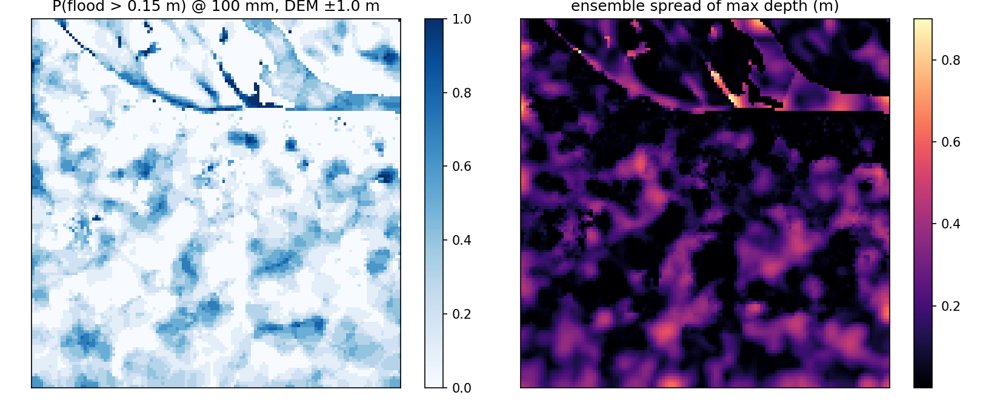
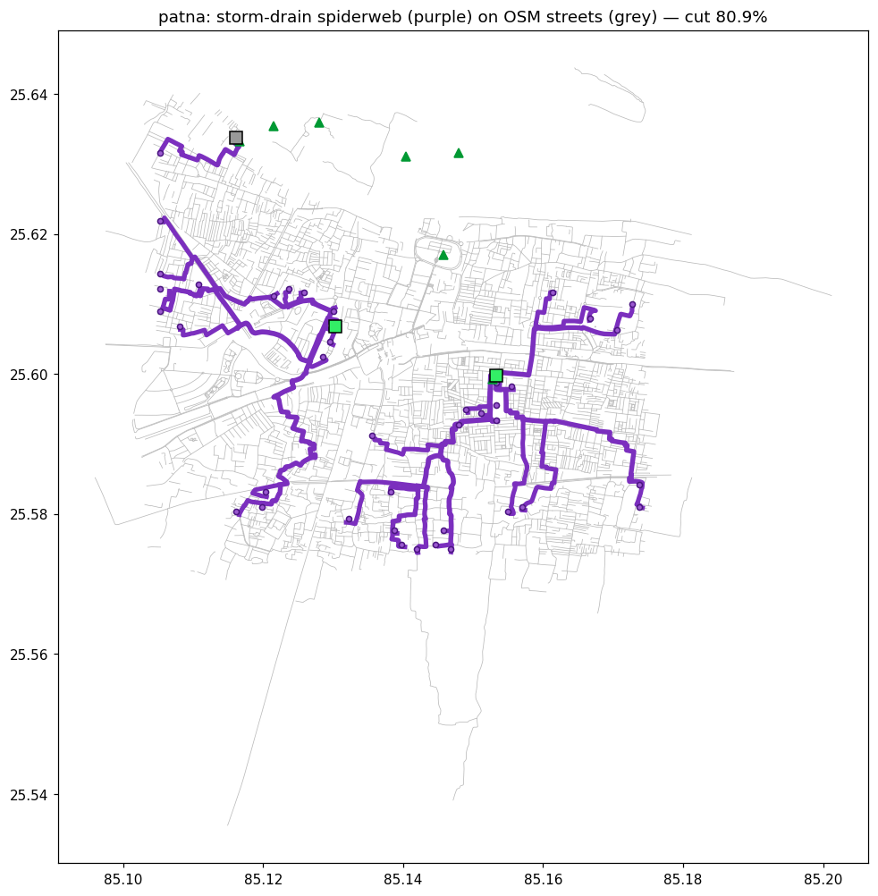

# Varuna FloodTwin: an honestly-validated, free-tier flood digital twin with street-routed drainage planning for Indian cities

*Ansh Vivek — independent researcher — anshvivek2003@gmail.com*

> Markdown mirror of `varuna-floodtwin.tex` (the submission copy). Numbers trace to the artifact
> bundles — see the provenance table in `paper/README.md`.

## Abstract

Urban waterlogging routinely paralyses Indian cities, yet municipal drainage planning rarely has
access to calibrated hydraulic models. We present **Varuna FloodTwin**, an end-to-end open pipeline
that builds a differentiable urban flood twin for any area of interest from free satellite data
(FABDEM, ESA WorldCover, JRC surface water, Sentinel-1), trains a millisecond what-if emulator, and
serves both through a public web dashboard — with every stage running on free tiers (Colab/Kaggle
GPUs to build, CPU to serve). We report three findings. **(1) An honest negative result:** against
8 Sentinel-1 flood masks over Patna, the dynamic twin scores mean CSI 0.033–0.041 — statistically
indistinguishable from static topographic baselines (depression depth 0.032, TWI 0.042, HAND-lite
0.051), and gradient calibration of per-land-class roughness/infiltration is near-null (held-out
CSI 0.048 → 0.049): the model predicts a comparable flooded *area* but not its *location*.
**(2) The failure is terrain-fundamental, not model-specific:** under a ±1 m spatially-correlated
DEM ensemble, total flooded area is stable (Patna 10.79 ± 0.35 km²) but only 5% of it is co-located
across members on deltaic flats, versus 52% in hillier Bengaluru. **(3) Planning can survive
location uncertainty:** intervention value is *measured by re-simulation* rather than assumed. A
dense storm-drain "spiderweb" routed along the real OpenStreetMap street graph — ~40 inlets, one
reverse multi-source Dijkstra from safe low-ground outfalls (never the river, which runs high
during floods) — cuts simulated street flooding by **73–89%** across four study areas at
100 mm/day, versus 21–26% for sparse least-cost canals, while *improving* cost-efficiency
(INR 850 vs INR 1,309 per m³ removed in Patna). Code, artifacts, and the live dashboard are public.

## 1. Introduction

Pluvial (rain-driven) waterlogging is among the most frequent climate impacts in South Asian
cities, and it is worsening under climate change. Yet the planning reality in most Indian
municipalities is a drainage map that predates the city's growth, no calibrated hydraulic model,
and no budget for commercial modelling. Tools that could plausibly change decisions must be
(i) buildable from *free, global* data for *any* area of interest, (ii) cheap enough to run
interactively, and (iii) honest about what they can and cannot claim.

**Contributions.**
1. **A reproducible satellite → twin → dashboard pipeline** on free infrastructure: a
   differentiable 2-D inertial flood twin (Bates et al. 2010) built per-city from FABDEM, ESA
   WorldCover and JRC surface water; a U-Net-style emulator for millisecond what-ifs; a public
   FastAPI + React-Leaflet dashboard with live rainfall sliders, intervention planners, exposure
   views and a grounded LLM brief.
2. **An honest validation** against Sentinel-1 SAR that places the twin *and* classical terrain
   indices (TWI, HAND) in the same low-CSI band on deltaic terrain, plus a DEM-perturbation
   ensemble that explains *why* — a diagnosis we believe transfers to other flat megacity
   floodplains.
3. **Street-graph drainage planning:** storm drains routed on the real OSM road network with
   gravity-aware costs and flood-safe outfall selection (low-lying non-built ground rather than
   the river), whose benefit is measured by re-simulating the carved terrain. Density is the
   decisive lever: a ~40-inlet spiderweb removes 4× more flood volume than 2–5 sparse canals at
   *lower* cost per m³.

## 2. System

**Build layer (GPU, once per city).** Google Earth Engine exports FABDEM (30 m; Copernicus GLO-30
fallback), ESA WorldCover 10 m, JRC permanent-water occurrence, and Sentinel-1 GRD scenes. The twin
domain is 128×128 at 60 m (a 7.7 km window). Terrain analysis yields candidate detention sites;
WorldCover classes map to Manning roughness and infiltration. The simulator is the Bates-2010
inertial shallow-water scheme in PyTorch — differentiable end-to-end; rainfall forcing uses
Open-Meteo. A flood-weighted U-Net emulator distils the twin for millisecond dashboard queries
(wet cells ×20 in the loss — plain MSE collapses to "never flood" because flooding is sparse;
validation RMSE ~5–10 cm, monotone dose-response).

**Serve layer (CPU, free hosting).** A FastAPI backend (Hugging Face Space, Docker) serves
committed per-city bundles — including cached OSM road graphs and exposure, so the deployed service
needs no external API access — and re-runs interventions live in seconds. The React-Leaflet
frontend (Vercel) exposes rainfall what-ifs, ward alerts, drainage/storage/excavation planners,
building- and road-level exposure, validation panels, and an LLM planning brief grounded in the
bundle's numbers. A new city builds in ~15 minutes on a free T4.

## 3. Honest validation: topographic routing does not co-locate flat-city flooding

**Protocol.** Sentinel-1 water masks for 8 Patna monsoon storms (2023–2025) vs the dynamic twin
forced with observed antecedent rain, on the same 60 m grid, permanent water (JRC>50%) masked on
*both* sides, one global detection threshold per method (no per-date tuning).

| method | best global threshold | mean CSI |
|---|---|---|
| static depression depth | 0.6 m | 0.032 |
| TWI (topographic wetness) | 13.45 | 0.042 |
| HAND-lite (height above drainage) | 8.57 m | 0.051 |
| dynamic twin (5-day antecedent) | 0.02 m | 0.041 |

The twin (mean CSI 0.033 with a 2-day window; best single storm 0.112) is indistinguishable from
static indices. It floods ~2,900 cells and SAR observes ~2,600 — comparable *area*, only ~12%
*overlap*. Gradient calibration of 16 per-WorldCover-class Manning/infiltration multipliers
(soft-Dice vs SAR, 4 train / 2 held-out storms) moves held-out CSI only 0.0483 → 0.0488, with
multipliers in [0.94, 1.14]: roughness and infiltration change *how deep*, not *where*, so their
co-location gradient is ≈0. A georeferencing artifact was ruled out: mirroring the SAR mask doubles
CSI, but the DEM is provably correctly oriented (corr(−DEM, JRC) = 0.80 unflipped vs 0.05 flipped;
the Ganga sits 7.8 m below domain mean) — the flip is a coincidental mirror and is not applied.

**Why: a DEM-uncertainty diagnosis.** Re-simulating under a 10-member ensemble of
spatially-correlated DEM perturbations (σ = 1 m, 5-cell correlation length — FABDEM's nominal error
class): total flooded area is robust (Patna 10.79 ± 0.35 km² at 100 mm) but only 0.58 km² (5%)
floods in ≥90% of members. In Bengaluru, with ~10× steeper relief, 4.56 of 8.82 km² (52%) is
robust. On a floodplain where metre-scale DEM noise exceeds the relief that decides which street
ponds, *no* topographic router — physical or index-based — can co-locate ponding; this is a
property of the terrain-data regime, not of the model. Reported skill in this regime should always
carry such an ensemble, and planning tools should be judged on decisions robust to it.

## 4. Planning that survives location uncertainty

All interventions are evaluated identically: modify the terrain, re-simulate the design storm
(100 mm/24 h), measure flooding on built-up cells, *excluding* the intervention's own cells from
both before and after masks (relocating water onto a drain does not count as reduction; the
excluded fraction is reported and stays below a few percent of built cells).

**Street-graph storm-drain spiderweb.** Sparse "worst-basin to nearest outfall" canals — 2–5
least-cost corridors over the DEM grid — cut 20.8% (Patna) / 25.7% (Bengaluru); preferring OSM road
cells and avoiding buildings *improved* the Bengaluru cut 3× (streets trace drainage valleys, so
buildability and hydraulics align). Scaling up: the domain's OSM roads (fetched once via Overpass,
cached per bundle; 42.8k nodes / 6.8k ways for Patna) form a graph whose nodes carry DEM
elevations; edge cost is street length plus an uphill penalty of 2,400 m per metre of climb. One
reverse multi-source Dijkstra from all outfalls labels every street with its gravity-cheapest
exit; ~40 inlets at the deepest cells of each flood basin (greedy with suppression, basin volume
apportioned by local depth) trace their exit chains, whose union is a forest with shared,
flow-accumulating trunks. Outfalls embody a flood-safety principle: **never the river** — during a
flood it runs high — but the lowest *safe* ground (non-built, buffered from buildings and the river
corridor), downhill domain exits, and detention pits, with pits handicapped by 2 km of equivalent
cost so conveying water away wins wherever gravity allows. Chosen streets are carved as 2 m
channels with strictly descending beds (shared trunks take the deepest bed, provably still
monotone), Manning n = 0.02, and the storm is re-simulated.

**Measured intervention ladder, Patna @100 mm** (indicative rates: INR 9,000/m drain, INR 300/m³
excavation, INR 6,000/m³ RCC storage):

| intervention | measured cut | flood removed | cost per m³ removed |
|---|---|---|---|
| gradient-optimised excavation (8 sites) | 4.1% | 0.06 M m³ | INR 758 |
| detention pits only (8 sites) | 7.8% | 0.11 M m³ | — |
| sparse canals + pits (v2 grid, 3.2 km) | 20.2–20.8% | 0.28 M m³ | INR 1,309 |
| **street spiderweb + pits (40 inlets, 44.5 km)** | **80.9%** | **0.87 M m³** | **INR 850** |
| distributed storage, 727 sited micro-basins | 30% | 0.43 M m³ | ~INR 9,200 |

**Results.** Across the four study areas the spiderweb cuts street flooding by **80.9%** (Patna),
**89.4%** (Patna-East), **80.3%** (Patna-West), **72.6%** (Bengaluru), versus 21–26% for sparse
plans; dose-response over 25–200 mm is monotone. Density improves *economics* as well as efficacy —
INR 850/m³ vs INR 1,309/m³ (Patna; Bengaluru INR 1,121/m³) — because shared trunks amortise length
across basins. The adaptive storage planner gives the complementary curve (each micro-basin sized
to its own gradient minimum): 727 sites buy a 30% cut in Patna; in Bengaluru the stable curve ends
near 30% (431 sites) and larger targets are honestly reported unreachable. Exposure grounds the
maps in assets: at 100 mm, 1,205 of 3,749 OSM buildings and 3,036 of 6,762 road segments in the
Patna window are at risk.

**Why we believe these decisions despite §3.** The quantities that drive the plans are the ones
the ensemble shows to be robust: total flooded volume, basin existence and approximate depth
ordering, and downhill topology — not the exact street that ponds first. The outputs are also
*portfolios* (many inlets, many micro-basins) whose value degrades gracefully if any single pond
shifts. Outputs are framed as relative planning guidance (which strategy, what density, where
first), not certified absolute depths.

## 5. Limitations and outlook

Hydraulics run at 60 m, coarser than the drawn street network; carved "drains" are full 60 m
cells, so absolute excavation volumes are resolution artifacts even though per-metre drain costing
is realistic. Depths are uncalibrated (§3 shows why per-class physics calibration cannot fix
co-location); groundwater recharge uses sample data pending CGWB records. Next steps: finer
national DEMs (CartoDEM), assimilating mapped drain networks, sub-grid street conveyance, and
validating *intervention deltas* against before/after SAR where cities have actually built
drainage.

## Reproducibility

Code, per-city bundles (incl. SAR masks and road graphs), tests, runbooks:
<https://github.com/Maverick-Ansh/project-varuna>. Live dashboard:
<https://project-varuna-iota.vercel.app> (API: `anshvivek-varuna-floodtwin.hf.space`). A new city
builds with one script on a free Colab/Kaggle T4 and serves from the committed bundle.
